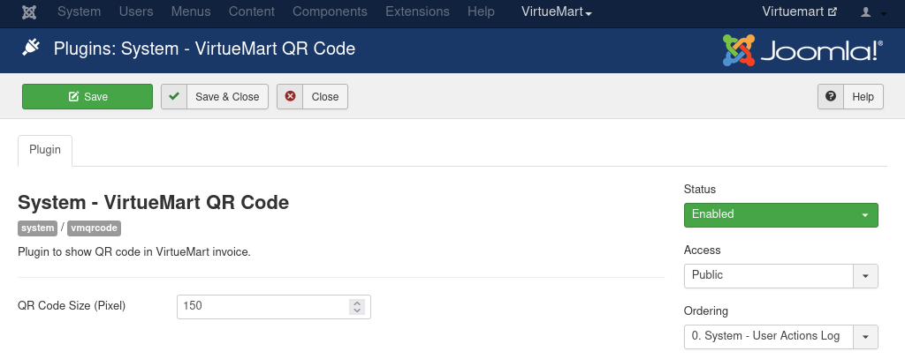
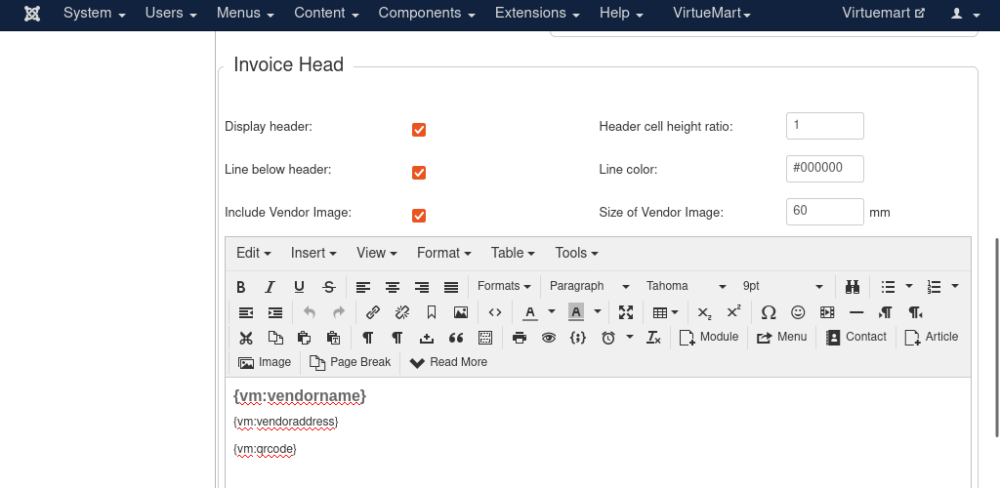
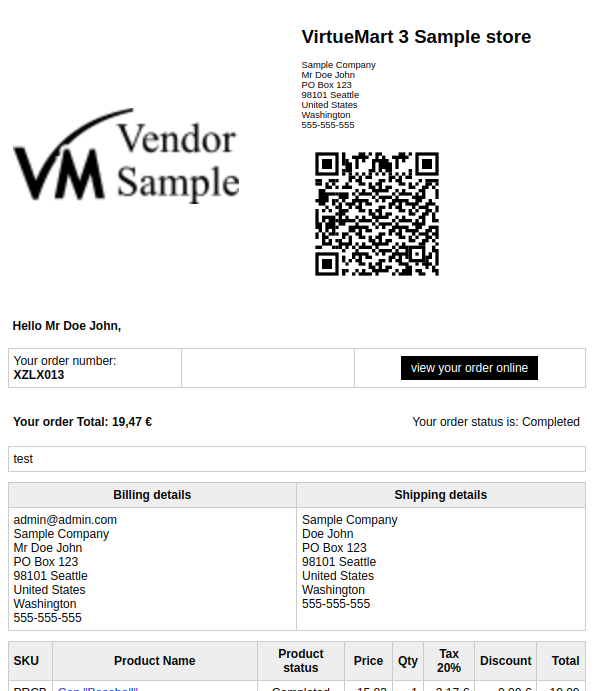
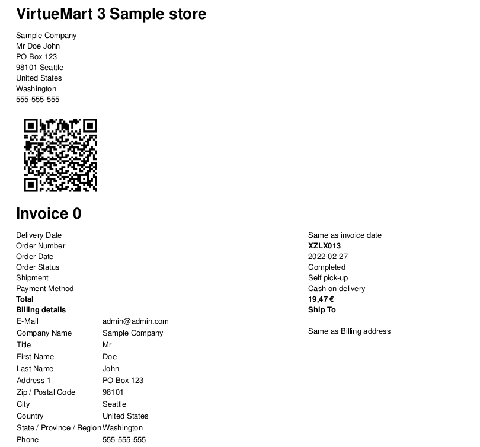
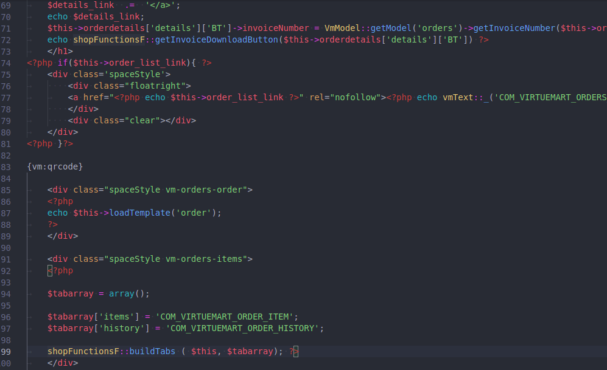
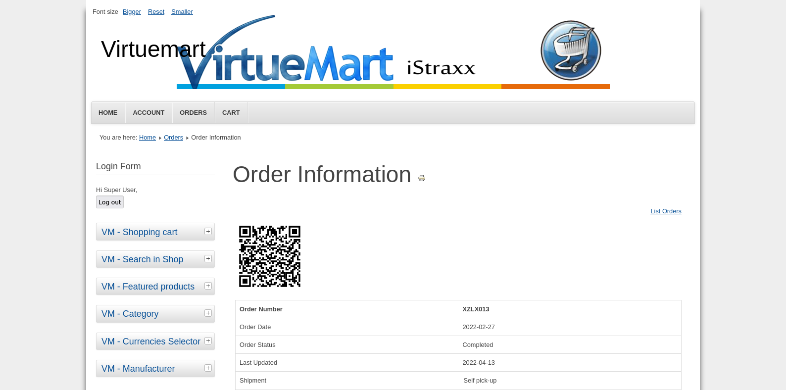
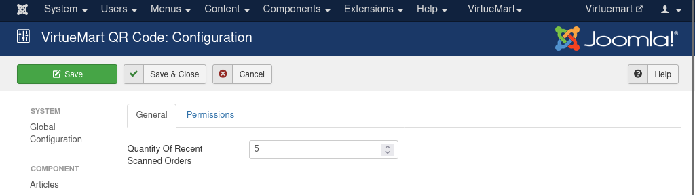
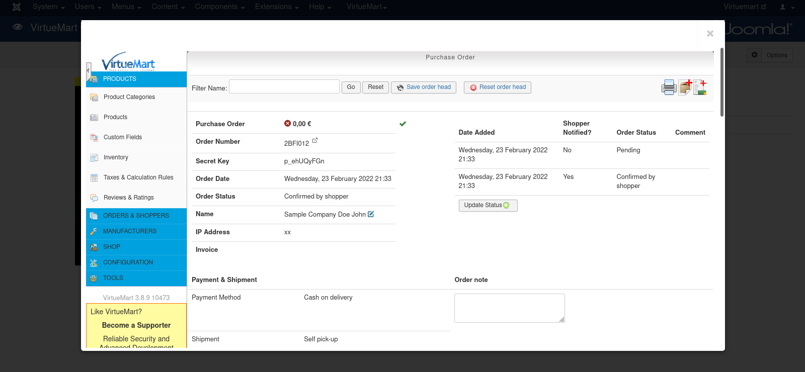

# VirtueMart QR Code

VirtueMart QR Code inserts QR code to VirtueMart order and helps site administrators quickly find the VirtueMart order by scanning the QR code with computer's webcam or phone's camera.

VirtueMart QR Code contains 2 Joomla! extensions:

- VirtueMart QR Code plugin: for inserting QR code to VirtueMart HTML order, PDF order and email. The QR code is order number (invoice number).

- VirtueMart QR Code component: for scanning the QR code created by the plugin and showing the QR code's VirtueMart order.

## Technical Requirements

- VirtueMart 3
- Joomla! 3.10
- HTTPS (for camera access permission)

## Installation

[Download the latest release](https://github.com/cmextension/vmqrcode/releases/) and install it in Joomla! back-end.

## Configuration and Usage

### The Plugin

In Joomla! back-end, enable `System - VirtueMart QR Code` plugin. In the configuration of this plugin, you can configure the size of the QR code, the default size is 150 pixels.

### Show QR Code in PDF and Email

Access VirtueMart in your Joomla! back-end, navigate to `Shop` on the left menu (`yourdomain/administrator/index.php?option=com_virtuemart&view=user&task=editshop`), then click `Invoices/Emails` tab, in `Invoice Head` section add `{vm:qrcode}` to where you want QR code to be shown.

Now QR code is shown in the header of order email...

...and the order PDF.

### Show QR Code in Joomla! Front-end Order Detail Page

Copy the file `components/com_virtuemart/views/orders/tmpl/details.php` to `templates/YOUR_CURRENT_TEMPLATE/html/com_virtuemart/orders/details.php`.

Edit `templates/YOUR_CURRENT_TEMPLATE/html/com_virtuemart/orders/details.php` and add `{vm:qrcode}` to where you want QR code to be shown.

Check an order in Joomla! front-end to see if QR code is visible.

### The Component

Access the QR code scanner by navigating to `Components` ->  `VirtueMart QR Code` in Joomla! back-end's top menu, the scanner (camera) is on the left side of the screen, the recent scanned orders are on the right side.

To configure the maximum quantity of recent order shown, click the `Options` button on the toolbar.

Show QR code in front of your camera, if the order is found, the order is shown in a modal.

## License

GNU General Public License version 2 or later. See [LICENSE](LICENSE).